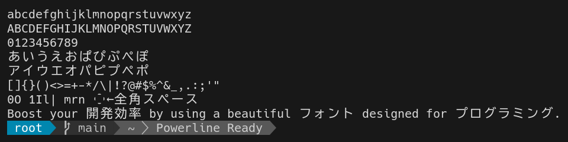
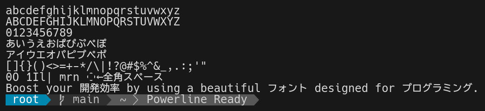

# プログラミング用等幅フォント Pennywort

Hack, BIZ UDGothic, Nerd Fonts を合成したプログラミング向けのフォントです．  
4 種類のスタイル × 2 パターンの半角全角比があります．

| フォントファミリー | スタイル                                 | 半角全角比 | Nerd Fonts |
| ------------------ | ---------------------------------------- | ---------- | ---------- |
| Pennywort          | Regular Bold Italic Bold Italic | 1:2        | ✔          |
| Pennywort23        | Regular Bold Italic Bold Italic | 2:3        | ✔          |

### [ダウンロード](https://github.com/okenakt/Pennywort/releases/latest)

## スクリーンショット

Regular 1:2

Regular 2:3

## ライセンス

This Font Software is licensed under the SIL Open Font License, Version 1.1.  
The generation script is licensed under the MIT License.  
See [LICENSE](./LICENSE.txt).
